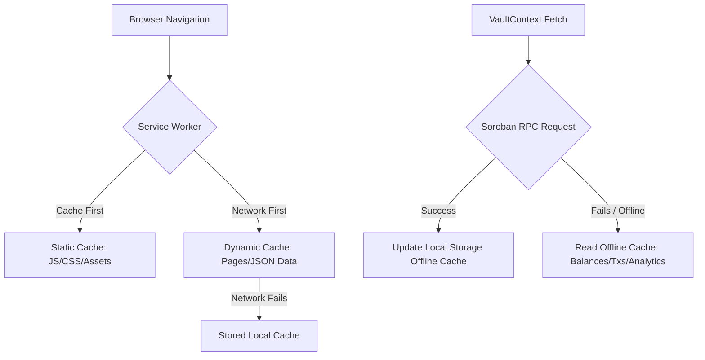

# Progressive Web App (PWA) & Offline Resilience Architecture

This document details the Progressive Web App configuration, service worker implementation, offline caching strategy, and resilience patterns established for the Axionvera Network Dashboard.

---

## 1. Architectural Overview

The PWA architecture is designed to support three core goals:
1. **Offline Availability**: Allow the dashboard interface to load and navigate during temporary network outages or low-connectivity environments.
2. **Resilience**: Ensure dynamic dashboard details (e.g., wallet balances, analytics, and transaction logs) fall back gracefully to a persistent local cache rather than failing or displaying empty screens.
3. **Graceful Upgrades**: Push background updates for new releases, prompting users to reload the application only when a fully updated bundle is ready.

---

## 2. Service Worker Strategy (`public/sw.js`)

A custom vanilla Service Worker is configured to intercept and manage all network requests originating from the dashboard client.

### Caching Tiers
1. **Static Pre-cache (`axionvera-static-v1`)**:
   - Initialized during the service worker `install` lifecycle event.
   - Caches core app shells, assets, and configuration files (e.g., `/`, `/manifest.json`, `/axionvera.svg`, `/env-config.js`).
2. **Dynamic Cache (`axionvera-dynamic-v1`)**:
   - Caches dynamically navigated Next.js pages and JSON metadata routes (`_next/data/...`) at runtime.
   - Restores the cached layout when the network is unreachable.

### Routing Strategies
- **Cache-First (Static Assets)**: Intercepts JS, CSS, fonts, SVG/PNG assets. Serves from cache immediately, fetching from the network only on cache miss.
- **Network-First (Documents & Page Data)**: Intercepts navigation documents and Next.js page JSONs. Attempts to fetch fresh data from the network; on failure or timeout, serves the cached counterpart.

---

## 3. Persistent Local Caching (`src/cache/offlineCache.ts`)

Because Soroban network client interactions (JSON-RPC transactions and events) are triggered client-side and utilize POST requests, they cannot be natively cached by a Service Worker (which only intercepts GET requests).

We implement a dedicated client-side cache manager (`src/cache/offlineCache.ts`) that persists core dashboard states to the browser's `localStorage` with distinct namespaces per connected wallet address:

- **Balances Cache**: Persists `VaultBalances` (`balance`, `rewards`).
- **Transactions Cache**: Persists `VaultTx[]` (recent deposits and withdrawals).
- **Analytics Cache**: Persists historical data points and reward metrics.

### Recovery Flow
1. On wallet connection or dashboard load, the client starts the RPC update.
2. If the RPC call succeeds, the fresh dataset is saved to `offlineCache` under the wallet's public key.
3. If the RPC call fails (due to offline status, network timeout, or RPC downtime), `VaultContext` checks for cached datasets.
4. If cached data is present, the app renders it and displays a non-intrusive notification: *"Displaying cached vault details."*

---

## 4. Lifecycle & Update Handling (`src/pwa/register.ts`)

To ensure a high-quality experience, application updates do not interrupt user flows:
- The service worker registers on client load and checks for updates.
- If a newer worker is compiled, it is installed in the background and goes into a `waiting` state.
- The `OfflineProvider` registers an `onUpdate` hook, notifying the user with a beautiful action toast.
- Clicking **Refresh App** sends a `SKIP_WAITING` event to the service worker, forcing immediate activation, and triggers a clean page reload.

---

## 5. UI Resilience (`src/pwa/OfflineProvider.tsx`)

The PWA experience features visual indicators keeping the user informed of connectivity transitions:
- **Offline Indicator**: A glassmorphic banner slides in from the bottom right with a pulsing amber warning dot and Lucide icon. It lets users know they are offline and using local cache.
- **Update Dialog**: A sleek update dialog presents a direct action button to hot-reload the dashboard with the latest version.

---

## 6. Testing Strategy

### E2E Testing with Playwright (`tests/e2e/offline.spec.ts`)
We simulate connection issues to verify resilience:
1. **Service Worker Registration**: Ensures the service worker installs on load.
2. **Offline Indicator visibility**: Uses `context.setOffline(true)` and asserts that the offline banner appears.
3. **Data Recovery validation**: Seeds `localStorage` with mock vault data, shuts down connection via `context.setOffline(true)`, navigates to the dashboard, and asserts that cached balances and transaction records are rendered.
