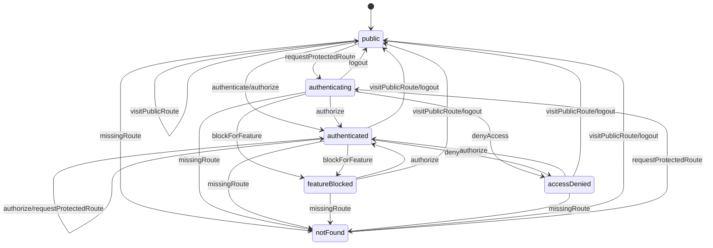

# Dashboard Navigation State Machine

The dashboard routes are validated by a finite state machine in `src/navigation/stateMachine.ts`.
The model centralizes authentication, authorization, feature gates, not-found handling, and invalid transition blocking before a route renders.

## States

| State | Meaning |
| --- | --- |
| `public` | A guest-safe route such as `/`, `/404`, or `/500`. |
| `authenticating` | A protected route was requested without an authenticated wallet/user. |
| `authenticated` | The route is known, enabled, and the user has the required role and permissions. |
| `featureBlocked` | The route belongs to a known feature gate that is currently disabled. |
| `accessDenied` | The route exists, but the user fails role or permission checks. |
| `notFound` | The route is not registered in the navigation/route access table. |

## Transition Diagram



## Guard Evaluation Order

1. Resolve the route from `ROUTE_ACCESS_CONFIG`.
2. Send unknown paths to `notFound` and redirect to `/404`.
3. Allow configured public routes immediately.
4. Require authentication for protected routes.
5. Evaluate feature gates (`dashboard`, `analytics`, `governance`, `monitoring`, `profile`, `admin`).
6. Evaluate RBAC role and permission requirements.
7. Allow rendering only when the transition is valid and the destination is authorized.

## Feature Gates

Feature gates default to enabled in `DEFAULT_FEATURE_GATES`. Runtime callers can pass overrides through `NavigationContext.features`, for example:

```ts
validateNavigationTransition("authenticated", {
  pathname: "/analytics",
  user,
  isAuthenticated: true,
  features: { analytics: false },
});
```

Disabled features transition to `featureBlocked` and redirect users back to `/dashboard`.

## Testing

Navigation flow coverage lives in `tests/navigation/stateMachine.test.ts` and validates public routing, authentication guards, role-based denial, feature blocking, not-found handling, and state derivation.
